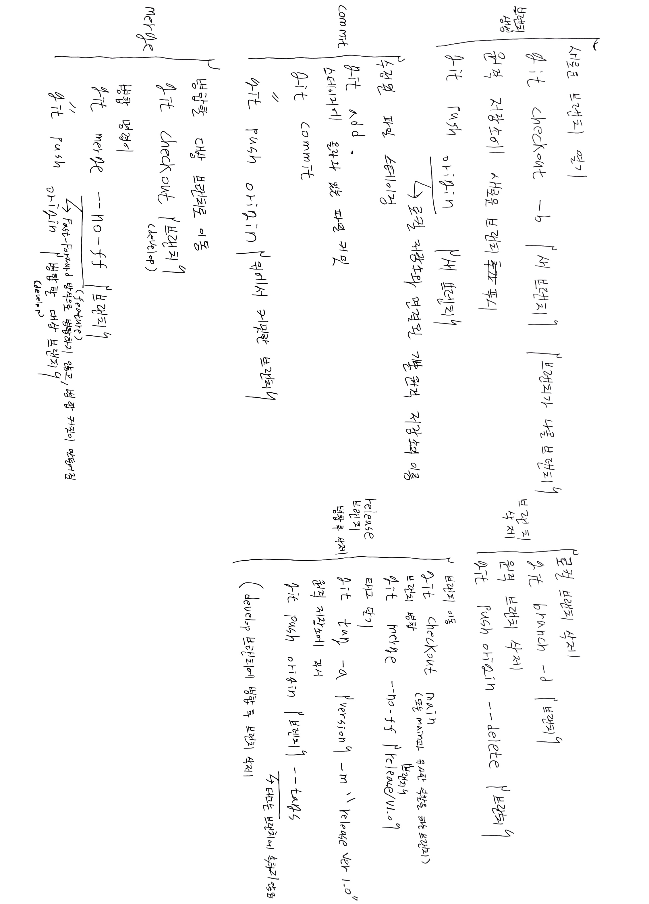

# git-test
git test.

# git 명령어 정리

# 이전에 정리해 두었던 내용
~/Desktop/Development/

pwd 현재 위치 경로 보기
ls -al 상세 정보 포함 디렉터리 보기

git init 초기화

git status 깃 상태 확인

git add " " 스테이징(최초 추적시, 파일 수정시) (커밋 대기 상태)
git add . 작업트리에서 수정한 모든 파일을 스테이징

git commit -m "message" 커밋, 메시지 등록

git log 버전 확인
git log -p 바뀐 내용 확인(커밋후)

git diff 수정 사항 보기(커밋전)
diff --git a/f1.txt b/f1.txt
index b323a15..9462317 100644
--- a/f1.txt    변경전 버전
+++ b/f1.txt 변경후 버전
@@ -1 +1 @@
-SOUCE : 2
+f1.txt : 2

git commit -am 스테이징-커밋 한번에
스테이지 - 커밋 - 레파지토리

git branch " " 브랜치 만들기 (분기)

git checkout " " 브렌치 전환

git log --branches --decorate --graph 브렌치 상황 보기
git log --branches --decorate --graph --oneline 간결하게 브렌치 상황 보기

## master 브랜치:

목적: 항상 배포 가능한 상태의 최종 제품 코드를 유지합니다. 실제로 프로덕션에 배포되는 안정적인 코드만 포함됩니다.

예시 이름: master
## develop 브랜치:

목적: 현재 개발 중인 기능들을 통합하는 브랜치입니다. 모든 새로운 기능과 변경 사항은 이 브랜치에서 테스트되고 통합됩니다.

예시 이름: develop
## feature 브랜치:

목적: 새로운 기능이나 특정 작업을 구현하기 위한 브랜치입니다. develop 브랜치에서 파생되며, 완료되면 develop으로 병합됩니다.

이름 형식: feature/{기능명}

예시 이름: feature/auth-login, feature/user-profile-update
## release 브랜치:

목적: 배포를 준비하는 브랜치로, 버그 수정 및 최종 테스트를 진행하는 곳입니다. 이 브랜치에서 완료된 코드는 master와 develop 브랜치에 병합됩니다.

이름 형식: release/{버전번호}

예시 이름: release/1.0.0, release/2.1.0
## hotfix 브랜치:

목적: 프로덕션에서 발견된 중요한 버그를 즉시 수정하는 브랜치입니다. master 브랜치에서 파생되며, 완료 후 master와 develop에 모두 병합됩니다.

이름 형식: hotfix/{버그명} 또는 hotfix/{버전번호}

예시 이름: hotfix/login-crash, hotfix/1.0.1
## support 브랜치 (선택적):

목적: 이전 버전의 유지보수와 지원을 위해 사용될 수 있습니다. 일반적으로 긴급한 수정이 필요할 때 사용합니다.

이름 형식: support/{버전번호}

예시 이름: support/1.x